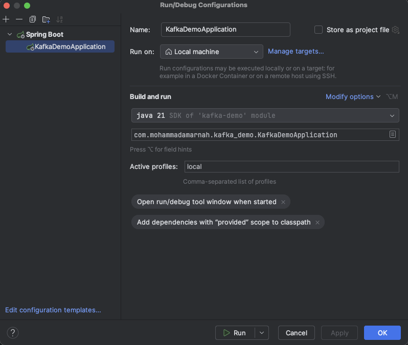

# Kafka Spring Boot Demo

## Local setup
* Install [sdkman](https://sdkman.io/), a Java version manager
* Install Java 21 using `sdk install java 21.0.8-amzn`
* Make sure you have docker installed and run the docker images `docker-compose up -d`
* It is recommended that you run this app using IntelliJ using the run configuration below
* You can also run without IntelliJ using the following command: `./mvnw clean compile package && java -jar ./target/kafka-demo-0.0.1-SNAPSHOT.jar`

### IntelliJ Run Configuration
